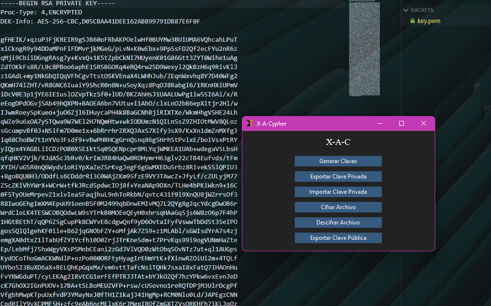

## **XAC**

X-Art-Cypher permite **cifrar y descifrar archivos** utilizando una combinación de RSA (8192 bits) y AES (256 bits). Es ideal para proteger datos sensibles de forma segura y eficiente.



### **Características**
- Cifra cualquier tipo de archivo: documentos, imágenes, archivos comprimidos (.rar, .zip), entre otros.
- Utiliza **RSA (8192 bits)** para garantizar la seguridad de las claves.
- Utiliza **AES (256 bits)** para cifrar grandes volúmenes de datos de manera eficiente.
- Exporta e importa claves privadas para garantizar que los archivos puedan ser descifrados en otros equipos.
- Interfaz gráfica sencilla para facilitar su uso.
- Compatible con Windows y Linux.

---

### **Requisitos del Sistema**
- **Python 3.8+**
- Sistemas Operativos compatibles:
  - Windows 10/11
  - Distribuciones basadas en Debian (Ubuntu, Linux Mint, etc.)

---

### **Instalación**
1. **Clona el repositorio o descarga los archivos**:
   ```bash
   git clone https://github.com/xscriptorcode/xac.git
   cd xac
   ```

2. **Instala las dependencias requeridas**:
   Ejecuta el siguiente comando para instalar las librerías necesarias:
   ```bash
   pip install -r requirements.txt
   ```

3. **Ejecuta la aplicación**:
   Inicia el programa con:
   ```bash
   python main.py
   ```

---

### **Métodos de uso XAC**

## Mediante terminal:
### Comandos disponibles


### 1. Generar claves RSA
Utiliza el script generar_claves_cli.py para crear una clave pública y privada protegida por contraseña.

```bash
python3 generar_claves_cli.py --privada clave_privada.pem --publica clave_publica.pem --password tu_contraseña
```
* --privada: ruta donde se guardará la clave privada (protegida).

* --publica: ruta donde se guardará la clave pública.

* --password: contraseña para proteger la clave privada.

Ejemplo:

```bash
python3 generar_claves_cli.py --privada clave_privada.pem --publica clave_publica.pem --password segura123
```


### 2. Cifrar un archivo

```bash
python3 xac_cli.py cifrar ruta/al/archivo --clave ruta/a/clave_publica.pem
```

**Parámetros:**

- `ruta/al/archivo`: archivo que se desea cifrar.
- `--clave`: ruta del archivo `.pem` que contiene la clave pública.
- `--salida` (opcional): ruta del archivo de salida. Si no se indica, se añadirá `.cifrado`.

**Ejemplo:**

```bash
python3 xac_cli.py cifrar documento.pdf --clave clave_publica.pem --salida documento_seguro.dat
```

---

### 3. Descifrar un archivo

```bash
python3 xac_cli.py descifrar ruta/al/archivo_cifrado --clave ruta/a/clave_privada.pem --password contraseña
```

**Parámetros:**

- `ruta/al/archivo_cifrado`: archivo previamente cifrado.
- `--clave`: ruta al archivo `.pem` con la clave privada.
- `--password`: contraseña de la clave privada.
- `--salida` (opcional): ruta del archivo de salida. Si no se indica, se añadirá `.descifrado`.

**Ejemplo:**

```bash
python3 xac_cli.py descifrar documento_seguro.dat --clave clave_privada.pem --password mipassword --salida documento_recuperado.pdf
```

---

## Notas adicionales

- El script carga las claves directamente desde archivos `.pem`.
- Para cifrar se necesita una clave pública.
- Para descifrar se necesita una clave privada protegida por contraseña.

---
### Mediante GUI:

#### **1. Generar Claves**
- Haz clic en "Generar Claves" para crear un par de claves pública y privada.
- Exporta la clave privada para guardarla en un lugar seguro.

#### **2. Cifrar Archivos**
- Selecciona un archivo con el botón "Cifrar Archivo".
- Guarda el archivo cifrado generado en la ubicación deseada.

#### **3. Descifrar Archivos**
- Asegúrate de tener la clave privada utilizada para cifrar el archivo.
- Importa la clave privada y selecciona el archivo cifrado con el botón "Descifrar Archivo".
- Guarda el archivo descifrado en la ubicación deseada.

#### **4. Exportar e Importar Claves**
- Usa "Exportar Clave Privada" para guardar la clave privada en un archivo seguro.
- Usa "Importar Clave Privada" para recuperar la clave y descifrar archivos.

---

### **Estructura del Proyecto**
```
xac/
├── main.py             # Archivo principal
├── interfaz.py         # Interfaz gráfica con Tkinter
├── cifrado.py          # Funciones de cifrado y descifrado
├── claves.py           # Funciones de gestión de claves
├── requirements.txt    # Dependencias necesarias
└── README.md           # Instrucciones y documentación
```

---

### **Dependencias**
El programa utiliza las siguientes librerías de Python:
- `tkinter`: Para la interfaz gráfica.
- `cryptography`: Para la implementación de RSA y AES.
- `ttkbootstrap`: Para un diseño moderno de la interfaz.

Instálalas con:
```bash
pip install -r requirements.txt
```

---

### **Limitaciones**
- Actualmente, el programa está en **español** y no detecta automáticamente el idioma del sistema.
- Los archivos cifrados pueden ser ligeramente más grandes debido a la codificación Base64.

---

### **Licencia**
Este proyecto está licenciado bajo la [MIT License](https://opensource.org/licenses/MIT).
